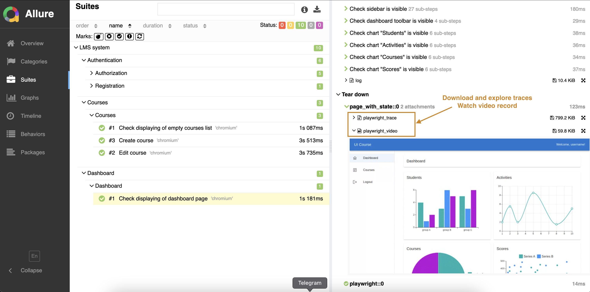
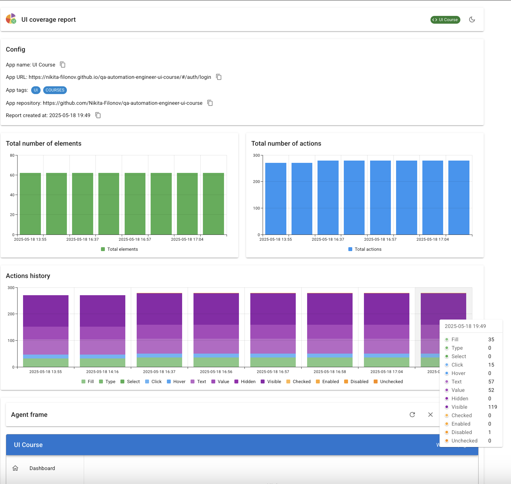
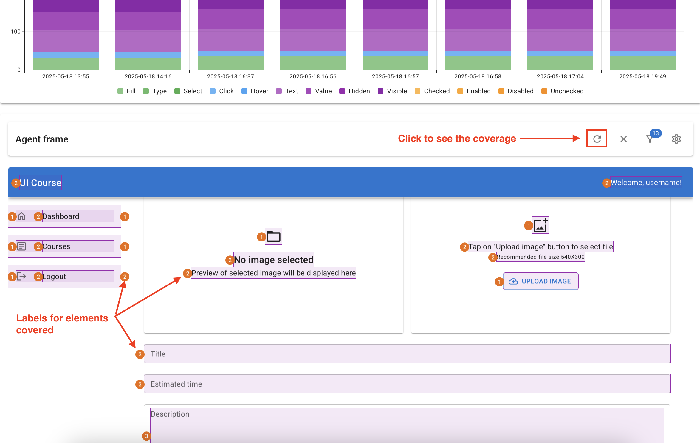

# <p align="center"> Playwright Test Automation: <a href="https://nikita-filonov.github.io/qa-automation-engineer-ui-course/#/auth/login"> UI Course Test Application </a></p>

This project implements automated tests for
the [UI Course Test Application](https://nikita-filonov.github.io/qa-automation-engineer-ui-course/#/auth/login). The test application’s source code is available
on [GitHub](https://github.com/Nikita-Filonov/qa-automation-engineer-ui-course).

## Contents

> - [Project Overview](#project-overview)
> 
> - [Technology Stack](#technology-stack-and-tools)
>
> - [Run Tests Locally](#run-tests-locally)
>
> - [View Allure Report](#view-allure-report)
>
> - [View UI-coverage Report](#view-ui-coverage-report)
>
> - [See the Report on GitHub Pages](#see-the-report-on-github-pages)


### Project Overview

The goal of this project is to automate the testing of the UI Course application using Playwright. The project structure follows best practices
for organizing test code with clear, maintainable scripts. 

> [!TIP]  
> **GitHub Actions** are used to run tests, generate reports and publish the [results](https://alzuewa.github.io/playwright_python_test_project).
> 
> [See below](#run-tests-locally) how to run them locally.
>


### Technology Stack and Tools
<p  align="center">
    
    
    
    
    
    
</p>

### Run Tests Locally

1. Clone the repository

```bash
git clone https://github.com/alzuewa/playwright_python_test_project.git
```

2. `cd` to the project's directory

```bash
cd playwright_python_test_project
```
3. In project root create virtual environment

###### Linux / MacOS

```bash
python3 -m venv venv
source venv/bin/activate
```

###### Windows

```bash
python -m venv venv
venv\Scripts\activate
```

4. Install dependencies

Once the virtual environment is activated, install the project dependencies listed in `requirements.txt`:

```bash
pip install -r requirements.txt
```

5. Do additional Playwright setup (if needed)

Local run requires Playwright browsers which you might need to [install](https://playwright.dev/python/docs/intro) if never run Playwright before:

```bash
playwright install
```

6. Run the tests with Allure Report generation

```bash
pytest -m 'regression'
```

This will execute all tests in the project and display the results in the terminal. In the project root, `allure-results` directory will be generated. 
It will also generate:
- `videos` directory - contains tests execution video recordings;
- `traces` directory - contains detailed information about test execution useful for debugging.

Both `videos` and `traces` are linked to each test in the Allure Report and can be conveniently viewed from within it.

### View Allure Report

If Allure Report is [installed](https://allurereport.org/docs/install/) on your computer, you can view it after [running tests locally](#run-tests-locally). To do so, run:

```bash
allure serve allure-results
```

This command will open the Allure Report in your default web browser.
<p align="center">
    
</p> 

### View UI-coverage Report

This project uses `ui-coverage-tool` [library](https://github.com/Nikita-Filonov/ui-coverage-tool) which gathers information about tests actions with elements in user interface and present the results as a UI coverage report.

After [running tests locally](#run-tests-locally), `coverage-results` directory was created. To get a report on UI coverage, run:
```bash
ui-coverage-tool save-report
```
You see new files have appeared in project root: `coverage.html`, `coverage-history.json`, `coverage-report.json`.

Open `coverage.html`: 
- See the graphs on total elements and its properties covered.
- Interact with a real app inside the frame and look at the labels on elements indicating the number of interactions done during tests run.

<div style="display: flex;">
    <div style="margin: 5px; width: 50%;">
        
    </div>
    <div style="margin: 5px; width: 50%;">
        
    </div>
</div>


### See the Report on GitHub Pages
> [!NOTE]  
> You can get Allure Report on the project tests run from **GitHub Pages** [here](https://alzuewa.github.io/playwright_python_test_project).
>